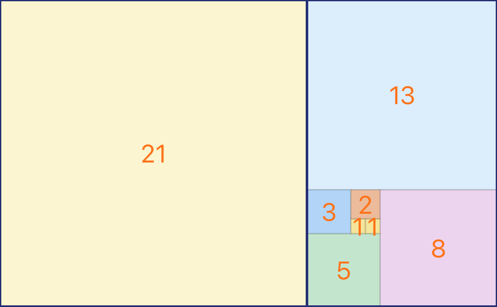
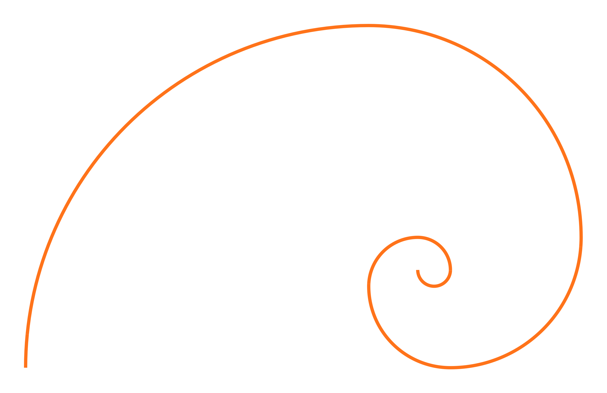
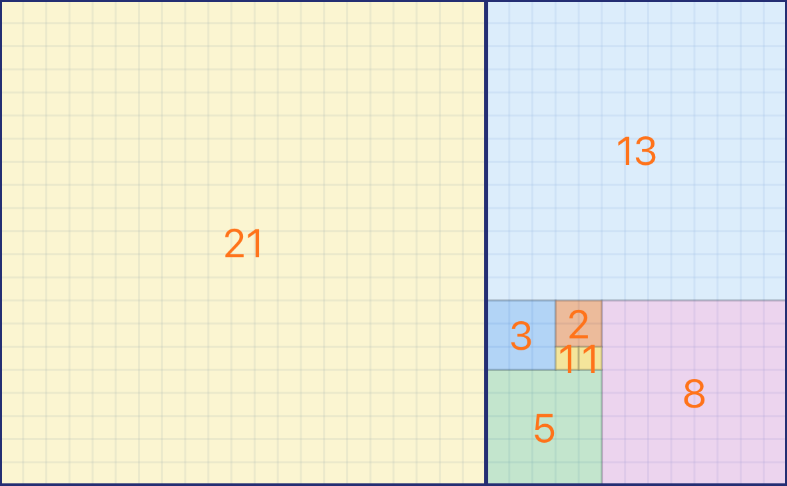

# 🌀 Fibonacci Demo — Pythonista Spiral Visualizer

**A polished Fibonacci spiral generator built with [Pythonista 3](https://omz-software.com/pythonista/), optimized for iPhone 14 Pro Max.**  
This project explores mathematical beauty through dynamic tiling, golden-ratio geometry, and safe-area-aware UI rendering.

---

## 📖 Overview

The Fibonacci Demo renders a precise sequence of squares and connecting spiral arcs using the **Fibonacci series**.  
Designed for **Pythonista 3** on iOS, it demonstrates how mathematical patterns can be turned into interactive visual art within a mobile coding environment.

The app’s interface is fully responsive, visually clean, and adapts seamlessly to notched screens and rounded safe areas.

---

## ✨ Core Features

- **Safe-Area Aware Layout** — fits perfectly on all iPhone models, including iPhone 14 Pro Max (430 × 932 pt)  
- **Dynamic Spiral Rendering** — computes Fibonacci tiles and arcs in real time  
- **Colorized Tiling Modes** — accent palettes for striking golden-ratio visuals  
- **Interactive Controls** — toggle overlays, adjust scaling, and export images  
- **Retina-Ready Output** — high-resolution spiral art suitable for print or wallpapers  

---

## 🧩 Architecture

The visual composition is rendered entirely with the Pythonista `ui` module.  
Fibonacci values define the grid, while Bézier arcs trace the spiral through consecutive tile corners.

Key routines:

- `build_fib_sequence(n)` — generates Fibonacci values for tiling dimensions  
- `draw_tiles(ctx, seq)` — renders each square with grid alignment  
- `draw_spiral(ctx, seq)` — overlays arcs through tile quadrants using geometric continuity  
- `safe_area_insets()` — adapts drawing bounds for devices with a notch or home indicator  

---

## 📱 Installation

1. Open **Pythonista 3** on your iPhone or iPad.  
2. Copy or import `fibonacci_demo_final.py` into your **Documents** folder.  
3. Run the script — the Fibonacci spiral viewer launches immediately.  

---

## 🖼 Preview

| Fibonacci Tiling | Spiral Overlay | Grid Mode |
|:----------------:|:---------------:|:----------:|
|  |  |  |

---

## 🧮 Mathematical Notes

The Fibonacci sequence {1, 1, 2, 3, 5, 8, 13, …} approximates the **Golden Ratio (φ ≈ 1.618)** as it progresses.  
This script visualizes that relationship through recursive square tiling and continuous arc tracing — a geometric manifestation of φ in two dimensions.

---

## 🧑‍💻 Technical Requirements

- **Pythonista 3** (latest version)  
- **iOS 16 or newer**  
- Screen optimized for **iPhone 14 Pro Max**  
- No external dependencies required  

---

## 🗓 Version History

| Version | Date | Changes |
|:--------:|:----:|:--------|
| **1.1** | 2025-11-12 | Added new screenshot and README update for GitHub release |
| **1.0** | 2025-11-11 | Initial public release — full Fibonacci spiral implementation with safe-area support |

---

## 🪪 License

This project is released under the [MIT License](LICENSE).  
You may use, modify, and distribute this software freely, provided that proper credit is given.

---

## 👤 Author

**blastwave**  
Autodidact developer and visual-computing enthusiast exploring Pythonista’s creative limits on iOS.  
Follow along for more mobile-native experiments combining code, geometry, and design.

---

## 💡 Future Directions

- Animated spiral growth visualization  
- Tap-to-zoom and pan gestures  
- Color palette presets inspired by natural patterns  
- Export resolution scaling for print media  

---

> *“Mathematics reveals its secrets only to those who approach it with pure love, for its own beauty.”*  
> — Archimedes